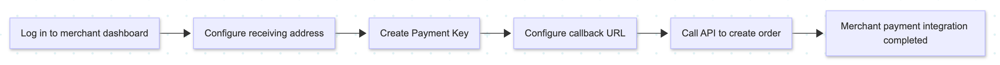

<h2 align="center">
   
  On-Chain Payments, Under Your Control.
</h2>

<h3 align="center">
  Official Website: <a href="https://ds.pro/pay">ds.pro</a>  
  <strong>English</strong>&nbsp;&nbsp;|&nbsp;&nbsp;<a href="./README.zh-CN.md">简体中文</a>
</h3>

  

 

# What Is DigitalShield-Pay
DigitalShieldPay is a non-custodial on-chain payment integration tool for developers and merchants. It creates orders, matches on-chain transactions, and synchronizes payment status. Before using it, confirm that your business may lawfully accept the relevant digital assets in every jurisdiction where it operates.

# Why Choose DigitalShield-Pay

DS-Pay (Digital Shield Pay) is built on the Digital Shield wallet ecosystem. It provides order creation, on-chain transaction monitoring, order-status synchronization, and webhook notifications through standard HTTP APIs.

- **Non-custodial fund flow**: funds move directly from the payer's wallet to the merchant's receiving address. DS-Pay never takes possession of funds and does not participate in custody, transfers, or settlement.

- **Platform service fees**: DS-Pay currently charges no platform transaction service fee. Blockchain network, wallet, and third-party fees are excluded. Fee policies may change; refer to the latest official terms.

- **Order-level transaction matching**: on-chain payments are linked to merchant orders, with status records for merchant-initiated post-payment handling.

- **Real-time on-chain monitoring**: DS-Pay continuously monitors target network transaction events, synchronizes on-chain payment results, and updates order status automatically.

- **Standardized system integration**: standardized HTTP APIs and asynchronous callback notifications make it easy to integrate with existing business systems.

- **Multi-network compatibility**: DS-Pay supports multiple mainstream networks and a wide range of crypto payment scenarios.

| Network | Supported Tokens |
| --- | --- |
| &ensp;Ethereum | USDT, USDC |
| &ensp;BNB Chain | USDT, USDC |
| &ensp;Polygon | USDT, USDC |
| &ensp;Arbitrum | USDT, USDC |
| &ensp;Base | USDT, USDC |
| &ensp;Solana | USDT, USDC |
| &ensp;SUI | USDT, USDC |
| &ensp;TRON | USDT, USDC |
| &ensp;Polkadot AssetHub | USDT, USDC |

More networks and tokens are coming soon.
## Intended Use

DS-Pay may be used for lawful software services, digital content, e-commerce, and developer tools, subject to local law and platform policies. This project does not endorse the legality, compliance, or suitability of any particular industry or business model.

## Compliance and Acceptable Use

- Merchants are responsible for ensuring that their products, services, marketing, taxes, consumer-protection practices, and digital-asset payment activity comply with applicable law.
- DS-Pay must not be used for fraud, money laundering, terrorist financing, illegal gambling, sanctions evasion, infringement, unlawful goods, or any other illegal activity.
- DS-Pay does not provide legal, tax, investment, or financial advice and makes no guarantee regarding digital-asset value, availability, or transaction finality.
- Never commit private keys, seed phrases, `apiSecret` values, or other credentials to a public repository.

## How It Works

  

## Quick Integration

DS-Pay provides a lightweight integration model that minimizes development effort. After completing the basic merchant configuration, merchants can quickly begin accepting cryptocurrency payments.

  

- Log in to the merchant dashboard: quickly register and sign in by scanning a QR code with WalletConnect.

- Configure receiving address: supports 9 blockchain networks and 2 settlement tokens, providing 18 receiving combinations.

- Create a Payment Key: generate a Payment Key with one click and rotate it as needed to secure API access.

- Configure callback URL (optional): receive real-time order status notifications and connect them with your business system.

- Call the order creation API: standardized public APIs allow merchants to create orders with minimal development effort.

Full documentation: [SDK Integration Guide](./SDK/SDK.en-US.md)

## Demo

The mock merchant demo lets you experience the complete DS-Pay payment integration flow.

| Integration Guides                                  |
|-----------------------------------------------------|
| [Java Integration Guide](./Demo/back-end/java)      |
| [Node.js Integration Guide](./Demo/back-end/nodejs) |
| [PHP Integration Guide](./Demo/back-end/php)        |
| [Frontend Integration Guide](./Demo/front-end/) |

[View More Demos](./Demo)

## Contact Us

For integration support, issue feedback, or partnership inquiries, feel free to contact us.

| Channel | Contact |
| --- | --- |
| Telegram Channel | https://t.me/digitshield |
| Telegram Community | https://t.me/DigitaShield |
| X Official | https://x.com/DigitShield_HQ |
| X Chinese | https://x.com/DigitShield_ZH |
| Email | service@ds.pro |
