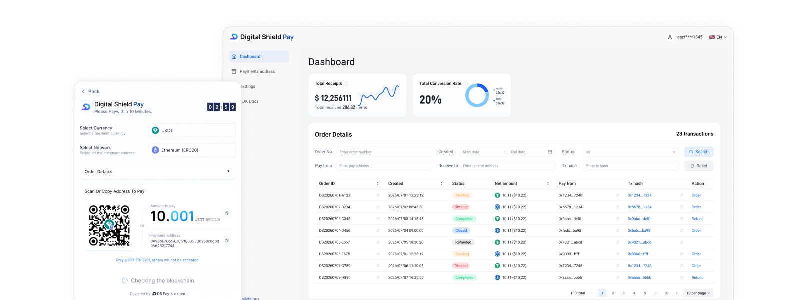
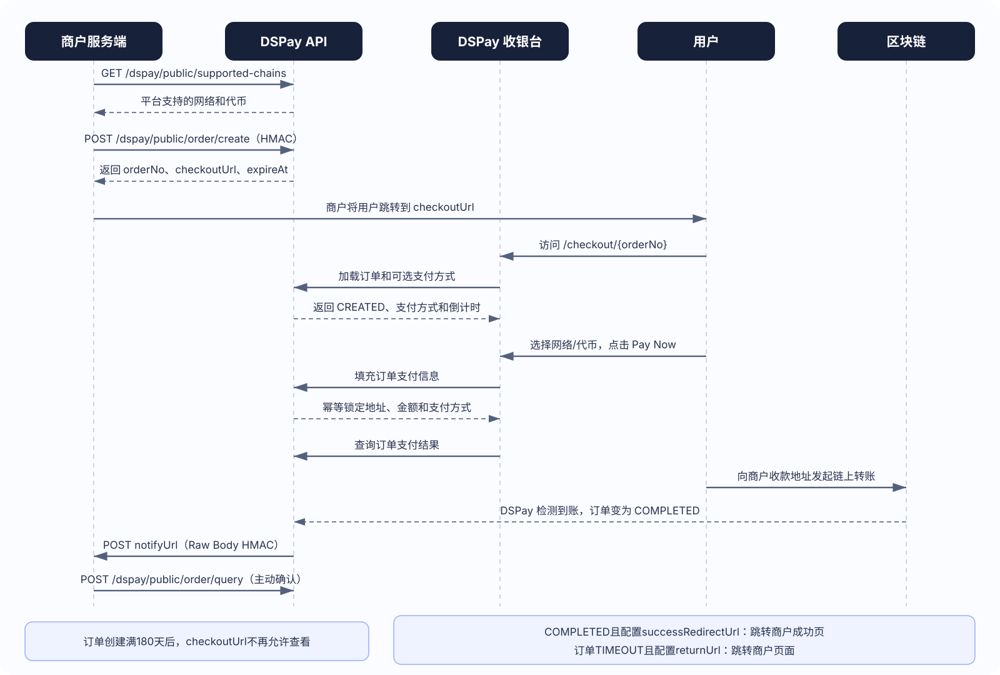
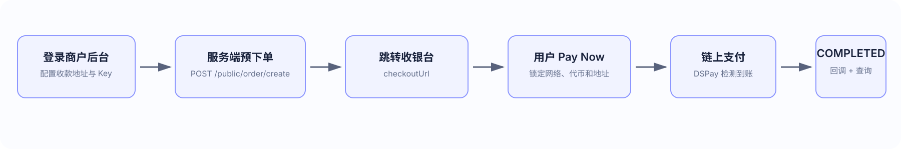

<h2 align="center">
   
  链上支付，尽在掌控。
</h2>

<h3 align="center">
  官方网站：<a href="https://ds.pro/pay">ds.pro</a>  
  <a href="./README.md">English</a>&nbsp;&nbsp;|&nbsp;&nbsp;<strong>简体中文</strong>
</h3>

  

 

# 什么是 DigitalShield-Pay
DigitalShieldPay 是一款面向开发者和商户的非托管型链上支付集成工具，用于创建订单、匹配链上交易并同步支付状态。使用前请确认您的业务与所在地区允许接收相关数字资产付款。

# 为什么选择 DigitalShield-Pay

DS-Pay（Digital Shield Pay）基于 Digital Shield 钱包生态构建，提供订单创建、链上交易监测、订单状态同步和回调通知能力。商户可通过标准 HTTP API 与现有业务系统集成。

- **非托管资金架构**：用户资金从付款方钱包直接转入商户收款地址。DS-Pay 不接触资金，也不参与资金托管、转账或结算。

- **平台服务费**：当前不收取平台交易服务费。区块链网络费用、钱包费用及第三方费用不在此范围内；费率政策可能调整，以官网最新说明为准。

- **订单级交易匹配**：将链上支付交易与商户订单关联，并记录商户发起的支付后处理状态。

- **实时链上监控**：DS-Pay 持续监控目标网络的交易事件，同步链上支付结果，并自动更新订单状态。

- **标准化系统集成**：通过标准化 HTTP API 和异步回调通知，可轻松接入现有业务系统。

- **多网络兼容**：DS-Pay 支持多个主流区块链网络，广泛适用于各类加密货币支付场景。

| 网络 | 支持的代币 |
| --- | --- |
| &ensp;Ethereum | USDT, USDC |
| &ensp;BNB Chain | USDT, USDC |
| &ensp;Polygon | USDT, USDC |
| &ensp;Arbitrum | USDT, USDC |
| &ensp;Base | USDT, USDC |
| &ensp;Solana | USDT, USDC |
| &ensp;SUI | USDT, USDC |
| &ensp;TRON | USDT, USDC |
| &ensp;Polkadot AssetHub | USDT, USDC |

更多网络和代币即将上线。
## 适用场景

DS-Pay 可用于符合当地法律与平台政策的软件服务、数字内容、电子商务和开发者工具等场景。项目不为任何特定行业的合法性、合规性或适用性背书。

## 合规与使用限制

- 商户负责确保其商品、服务、营销、税务、消费者保护及数字资产收付行为符合所在地区的法律法规。
- 不得将 DS-Pay 用于诈骗、洗钱、恐怖融资、非法赌博、制裁规避、侵权、非法商品交易或其他违法活动。
- DS-Pay 不提供法律、税务、投资或金融建议，也不对数字资产的价值、可用性或交易最终性作出保证。
- 请勿将私钥、助记词、`apiSecret` 或其他敏感凭证提交到公开仓库。

## 工作原理

  

## 快速集成

DS-Pay 提供轻量化集成模式，有效降低开发工作量。完成基础商户配置后，即可快速上线加密货币收款服务。

  

- 登录商户控制台：支持通过 WalletConnect 扫码快速注册和登录。

- 配置收款地址：支持 9 个区块链网络和 2 种结算代币，共提供 18 种收款组合。

- 创建 Payment Key：一键生成 Payment Key，并可在需要时进行轮换，保障 API 访问安全。

- 配置回调 URL（可选）：实时接收订单状态通知，并与您的业务系统对接。

- 服务端预下单：商户服务端签名调用 `POST /dspay/public/order/create`，获取 `orderNo` 和 `checkoutUrl`。

- 跳转 DSPay 收银台：商户将用户跳转到 `checkoutUrl`，用户在收银台选择网络和代币并点击 Pay Now。

- 确认支付结果：商户验证异步回调，并使用 `POST /dspay/public/order/query` 主动查询兜底。浏览器跳转不能作为支付成功凭据。

完整文档：[SDK 集成指南](./SDK/SDK.zh-CN.md)

## 演示

模拟商户演示可让您体验完整的 DS-Pay 支付集成流程。

| 调用指南                                  |
|---------------------------------------|
| [java 集成指南](./Demo/back-end/java)     | 
| [NodeJs 集成指南](./Demo/back-end/nodejs) | 
| [PHP 集成指南](./Demo/back-end/php)       |
| [前端 集成指南](./Demo/front-end/)          | 

[查看更多演示](./Demo)

Demo 版本基线：Node.js `18.20.8` + npm `10.8.2`、JDK 11+、PHP 5.6+；前端需要支持 `crypto.randomUUID()` 的现代浏览器。Node.js只需一个版本。实际验证版本和依赖说明见 [Demo 已验证运行环境](./Demo/README.zh-CN.md#已验证运行环境)。

## 联系我们

如需集成支持、反馈问题或洽谈合作，欢迎联系我们。

| 渠道 | 联系方式 |
| --- | --- |
| Telegram 频道 | https://t.me/digitshield |
| Telegram 社区 | https://t.me/DigitaShield |
| X 官方账号 | https://x.com/DigitShield_HQ |
| X 中文账号 | https://x.com/DigitShield_ZH |
| 电子邮箱 | service@ds.pro |
